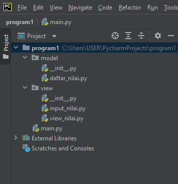
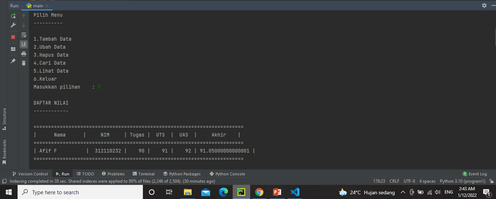
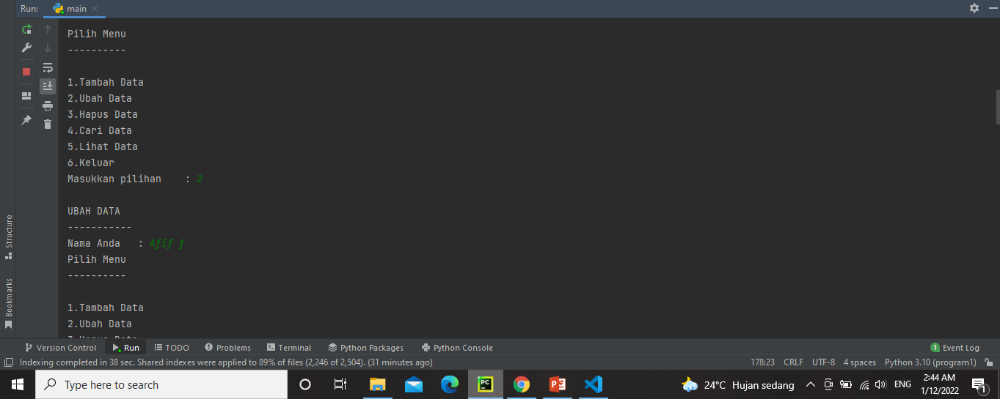
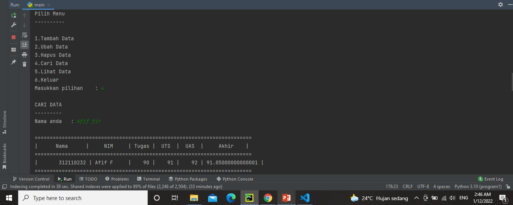

# UAS_B.Pemrograman
# Pertemuan 15 (UAS)
## 1. Soal : Buatlah Package dan Modul Dengan Struktur



<li> Penjelasan </li>

daftar_nilai.py berisi modul untuk: tambah_data, ubah_data, lihat_data ,hapus_data , dan cari_data. <p>

<li> Tambah Data </li>

```bash
    def tambah_data():
    global data_mahasiswa
    print("TAMBAH DATA")
    print("------------")
    nama = nama_input()
    nim = nim_input()
    tugas = tugas_input()
    uts = uts_input()
    uas = uas_input()
    nilai_akhir = (tugas*30/100)+(uts*35/100)+(uas*35/100)
    data_mahasiswa[nama] = [nim, tugas, uts, uas, nilai_akhir]
    print()
    return data_mahasiswa
```

<li> Output Tambah Data </li>


<li> Lihat Data </li>

```bash
    def cetak_daftar_nilai():
    if len(data_mahasiswa) <= 0:
        no_data()
    else:
        print("DAFTAR NILAI")
        print("------------")
        print()
        print(72 * "=")
        print("|      Nama      |     NIM     | Tugas |  UTS  |  UAS  |     Akhir    |")
        print(72 * "=")
        for a in data_mahasiswa.items():
            print(f"| {a[0]:15} | {a[1][0]:10} | {a[1][1]:5} | {a[1][2]:5} | {a[1][3]:5} | {a[1][4]:12} |")
            print(72 * "=")
            print()
```

<li> Output Lihat Data </li>



<li> Ubah Data </li>

```bash
    def ubah_data():
    if len(data_mahasiswa) <= 0:
        no_data()
    else:
        print("UBAH DATA")
        print("-----------")
        nama = input("Nama Anda\t: ")
        if nama in data_mahasiswa.keys():
            nim = int(input("NIM Mahasiswa\t: "))
            tugas = int(input("Nilai Tugas\t: "))
            uts = int(input("Nilai UTS\t: "))
            uas = int(input("Nilai UAS\t: "))
            nilai_akhir = (tugas*30/100)+(uts*35/100)+(uas*35/100)
            data_mahasiswa[nama] = [nim, tugas, uts, uas, nilai_akhir]
            print()
```

<li> Output Ubah Data </li>



<li> Cari Data </li>

```bash
    def cari_data():
    print("CARI DATA")
    print("---------")
    nama = input("Nama anda\t: ")
    print()
    for nama in data_mahasiswa.items():
        print(72*"=")
        print("|      Nama      |     NIM     | Tugas |  UTS  |  UAS  |     Akhir    |")
        print(72*"=")
        print(f"| {nama[1][0]:15} | {nama[0]:10} | {nama[1][1]:5} | {nama[1][2]:5} | {nama[1][3]:5} | {nama[1][4]:12} |")
        print(72*"=")
        print()
```

<li> Output Cari Data </li>



<li> Hapus Data </li>

```bash
    def hapus_data():
    if len(data_mahasiswa) <= 0:
        no_data()
    else:
        print("HAPUS DATA")
        print("-----------")
        nama = input("Nama Anda\t: ")
        if nama in data_mahasiswa.keys():
            del data_mahasiswa[nama]
            print()
```

<li> Output Hapus Data </li>


## Melihat Hasil Pencarian

1. Fungsi cetak_hasil_pencarian() sama seperti fungsi cari_data(), yaitu mencari data mahasiswa berdasarkan nama. <p>
2. input_nilai.py berisi modul untuk: input_data yang meminta pengguna memasukkan data. <p>

```bash
    def cetak_hasil_pencarian():
    if len(data_mahasiswa) <= 0:
        cari_data()
```

## Input Data

1. Untuk menginput data yang terdiri dari beberapa fungsi yaitu nama_input(), nim_input(), tugas_input(), uts_input(), uas_input(). <p>
2. main.py berisi program utama (menu pilihan yang memanggil semua menu yang ada). <p>

```bash
    def nama_input():
    global nama
    nama = input("Nama Mahasiswa\t: ")
    return nama


def nim_input():
    global nim
    nim = int(input("NIM Mahasiswa\t: "))
    return nim


def tugas_input():
    global tugas
    tugas = int(input("Nilai Tugas\t: "))
    return tugas


def uts_input():
    global uts
    uts = int(input("Nilai UTS\t: "))
    return uts


def uas_input():
    global uas
    uas = int(input("Nilai UAS\t: "))
    return uas
```

## Menu Pilihan

1. Import package view dan model agar dapat dieksekusi di main.py. <p>

```bash
    from view.view_nilai import *
    from model.daftar_nilai import *
```

2. Terdapat pilihan menu yang terdiri dari tambah data, ubah data, lihat data, hapus data, cari data dan menu untuk keluar dari program. <p>

```bash
    while True:
    print("Pilih Menu")
    print("----------")
    print("\n1.Tambah Data \n2.Ubah Data \n3.Hapus Data \n4.Cari Data \n5.Lihat Data \n6.Keluar")
    tanya = int(input("Masukkan pilihan\t: "))
    print()

    if tanya == 1:
        tambah_data()

    elif tanya == 2:
        ubah_data()

    elif tanya == 3:
        hapus_data()

    elif tanya == 4:
        cari_data()

    elif tanya == 5:
        cetak_daftar_nilai()

    elif tanya == 6:
        print("Program Selesai - Terima kasih!")
        break
```

## Sekian Terima Kasih